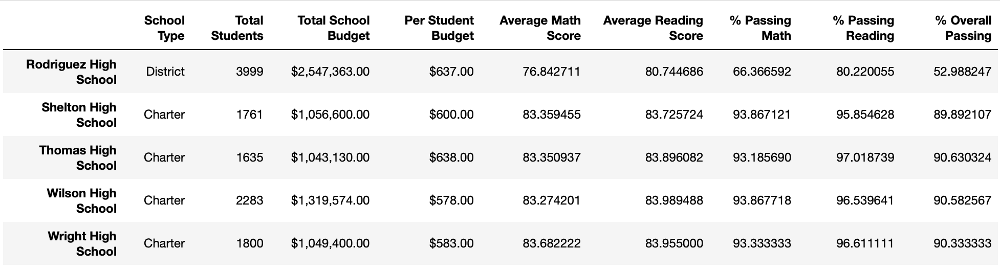
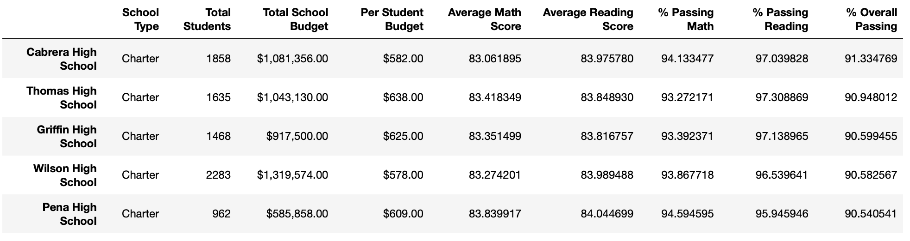
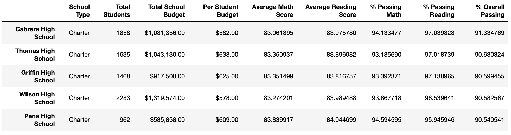
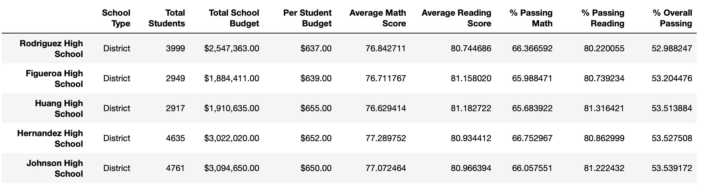
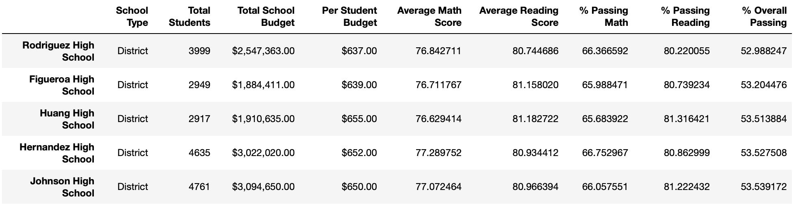

# School_District_Analysis
## Purpose
The purpose of this project was to remove the Thomas High School math and reading scores for the ninth graders and obtain the following:
* The district summary
* The school summary
* The top 5 and bottom 5 performing schools, based on the overall passing rate
* The average math score for each grade level from each school
* The average reading score for each grade level from each school
* The scores by school spending per student, by school size, and by school type

### Background
The Thomas High School ninth graders math and reading scores were found to be altered. Due to academic dishonesty these grades need to be dropped from the original analysis so the school averages aren't skewed.

## Analysis

### Overview of the School District Analysis
The purpose of this analysis is well defined (3 pt).

### Results
The results shown below address how each of the seven school district metrics were affected by the changes made to the data after removing the Thomas High School ninth grade math and reading scores.

1. The distric summary shows that the average math scores fell from 79.0 to 78.9, the average reading scores remained similar but would probably show a small discrepency with more decimal places. The percent passing math shows a 0.2% regression while the percent passing reading shows a 0.1% regression. The percent overall passing dropped from 65.2% to 64.9%.

* Old District Summary:

* New District Summary:

2. The school summary largely remains the same with the exception of Thomas High School. I have included a small snapshot of each school summary containing Thomas High School in each to highlight the differnces. The average math score fell from 83.41 to 83.35. The average reading score went up from 83.84 to 83.89. The average passing math percentage decreased from 93.27% to 93.18%. The average passing reading percentage decreased from 97.30% to 97.01% The interesting finding here is that while the average reading scores went up with the ninth graders removed, the passing percentage went down. That means although the ninth graders had lower reading scores, a higher percentage were passing than the other three grades combined. The overall passing percentage for Thomas High School went from 90.94% down to 90.63%. 

* Old School Summary:

* New School Summary:

Replacing the Thomas High Schools ninth-grade scores with "NaN", effectively lowers Thomas High Schools Overall Passing Percentage but does not lower it enough to move them from the 2nd ranked school. As stated above in the "School Summary" section, Thomas High Schools Overall Passing Percentage drops from 90.94% to 90.63%.

* Top 5 Performing Schools

* Bottom 5 Performing Schools

Replacing the Thomas High Schools ninth-grade scores with "NaN" does not affect any other schools scores or even Thomas High Schools 10th-12th grade scores.

* Old Math Scores vs New Math Scores By Grade

 

* Old Reading Scores vs New Reading Scores by Grade

 

Replacing the Thomas High Schools ninth-grade scores with "NaN" does not affect "Scores by School Spending", the "Scores by School Size", or the "Scores by School Type" because the student population does not increase/decrease. The scores do affect the Average Math Score, Average Reading Score, % Passing Math, % Passing Reading, and % Overall Passing. However, the change is negligible given the current formatting of the table.

* Old Scores by School Spending:

* New Scores by School Spending:

* Old Scores By School Size:

* New Scores by School Size:

Scores By School Type

* Old Scores By School Type:

* New Scores by School Type:

### Summary
In short, dropping the Thomas High School ninth-grade scores from the entire analysis resulted in the following:

1. The district's overall passing percentage dropped from 65.2% to 64.9%.
2. Thomas High School's average math score fell from 83.41 to 83.35 while the average passing math percentage decreased from 93.27% to 93.18%.
3. Thomas High School's average reading score went up from 83.84 to 83.89 while the average passing reading percentage decreased from 97.30% to 97.01% 
4. Thomas High School's overall passing percentage went from 90.94% down to 90.63%. 

