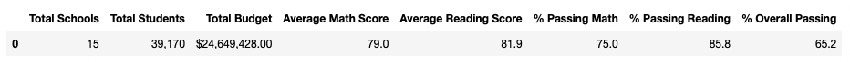

# School_District_Analysis
## Purpose
The purpose of this project was to remove the Thomas High School math and reading scores for the ninth graders and obtain the following:
* The district summary
* The school summary
* The top 5 and bottom 5 performing schools, based on the overall passing rate
* The average math score for each grade level from each school
* The average reading score for each grade level from each school
* The scores by school spending per student, by school size, and by school type

### Background
The Thomas High School ninth graders math and reading scores were found to be altered. Due to academic dishonesty these grades need to be dropped from the original analysis so the school averages aren't skewed.

## Analysis

### Overview of the School District Analysis
The purpose of this analysis is well defined (3 pt).

### Results
There is a bulleted list that addresses how each of the seven school district metrics was affected by the changes in the data (10 pt).

How is the district summary affected?

* Old District Summary:

* New District Summary:

How is the school summary affected?
* Old School Summary:

* New School Summary:

How does replacing the ninth graders’ math and reading scores affect Thomas High School’s performance relative to the other schools?

How does replacing the ninth-grade scores affect the following:
Math Scores By Grade
* Old Math Scores vs New Math Scores By Grade

 

Reading Scores By Grade
* Old Reading Scores vs New Reading Scores by Grade

 

Scores By School Spending

* Old Scores by School Spending:

* New Scores by School Spending:

Scores By School Size

* Old Scores By School Size:

* New Scores by School Size:

Scores By School Type

* Old Scores By School Type:

* New Scores by School Type:

### Summary
There is a statement summarizing four changes to the school district analysis after reading and math scores have been replaced (5 pt).
